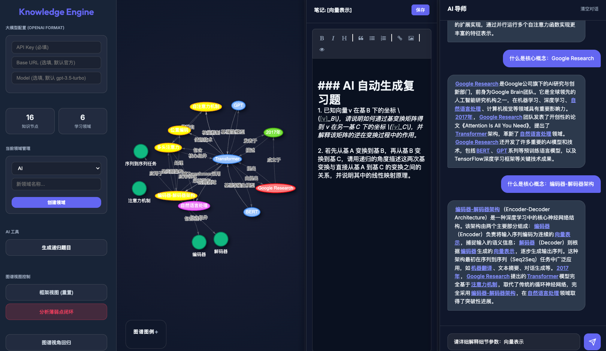
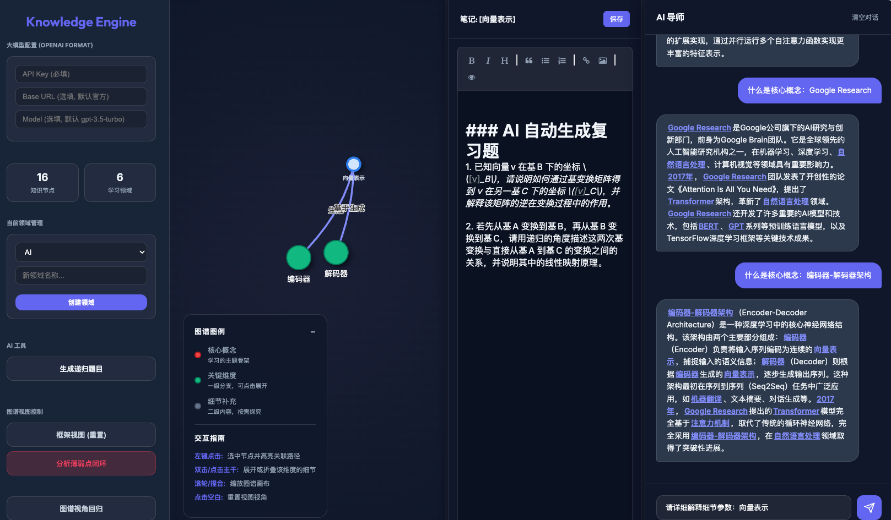

# 递归知识引擎 (Recursive Knowledge Engine)

这是一个基于 **“云端鉴权 + 本地执行”** 架构的智能知识图谱与学习辅助系统。它能够通过与 AI 的深度对话，自动提取专业术语、构建知识联系，并以动态交互的知识图谱形式展现，旨在通过“递归式”的深入探索帮助用户彻底掌握核心概念。

---



## 📂 项目结构

```text
recursive-knowledge-engine/
├── core/                   # 核心逻辑与配置
│   ├── bot.py              # LLM 交互封装 (支持流式响应)
│   ├── config.py           # 系统配置文件 (环境变量读取)
│   ├── database.py         # 本地数据库初始化与 Migration
│   └── utils.py            # 通用辅助函数
├── templates/              # 前端 UI 模版
│   └── index.html          # 主应用界面 (包含 Vis.js 图谱渲染)
├── app.py                  # 本地客户端启动入口 (Flask)
├── cloud_server.py         # 云端鉴权服务器启动入口
├── requirements.txt        # 项目依赖列表
├── .env                    # API 密钥配置 (需自行创建)
└── LICENSE                 # 商业/个人使用许可协议
```

---

## 🛠️ 环境准备

1. **Python 版本**: 3.8+
2. **安装依赖**:
   ```bash
   pip install -r requirements.txt
   ```
3. **API 配置**:
   在项目根目录下创建 `.env` 文件，填入您的大模型 API 密钥（例如阿里云百炼、OpenAI 等）：
   ```env
   DASHSCOPE_API_KEY=your_api_key_here
   OPENAI_BASE_URL=https://dashscope.aliyuncs.com/v1
   OPENAI_MODEL=model_name
   ```

---

## 🚀 快速启动

### 步骤 1: 启动云端鉴权中心
```bash
python cloud_server.py
```
默认运行在 `http://127.0.0.1:5001`。首次启动会自动生成 `cloud.db`，并初始化测试卡密（如 `BASIC-123`）。

### 步骤 2: 启动本地学习引擎
```bash
python app.py
```
访问 `http://127.0.0.1:5002`。如果是首次使用，系统会自动创建 `local.db` 数据库。

---

## 📖 使用教程

### 1. 递归式知识深挖
*   在右侧对话框中输入你想学习的知识点（如“量子纠缠”或“卷积神经网络”）。
*   AI 会生成详细解释，同时左侧图谱会自动渲染出该概念的**核心（Core）**、**主要维度（Primary）**及**细节（Detail）**。
*   点击图谱中的节点，可以针对该细分维度继续追问，实现递归学习。

### 2. 薄弱点诊断闭环
*   当你学习了一段时间后，点击左侧按钮 **“分析薄弱点闭环”**。
*   系统会根据您的学习记录，随机识别并高亮显示一个知识薄弱节点，通过红色高亮其依赖路径。



### 3. AI 题目生成
*   根据诊断出的薄弱点，选中该红色节点。
*   点击 **“生成递归题目”**。
*   系统会显示百分比进度条并调用 AI，针对该节点生成 1-2 道深度思考题，并直接**追加到该节点的笔记末尾**供您复习。

### 4. 笔记管理
*   点击任何节点，中间的**笔记面板**会加载该节点的专属 notes。
*   支持 Markdown 语法，实时编辑并手动/自动保存。

---

## ✨ 核心特性

- **三层渐进式架构**: 自动将知识归类为核心、维度、细节，保持视图清晰。
- **动态图谱交互**: 支持拖拽、缩放、点击关联高亮，支持双击节点展开/折叠。
- **图例折叠**: 图谱左下角的图例面板可点击 `+/-` 按钮进行收起或展示。
- **私有化存储**: 所有对话细节、笔记、图谱数据均存储在本地 `local.db`，隐私安全。
- **云端备份**: 支持授权用户一键将本地成果备份至云端。

---

## 📝 许可说明

本项目采用自定义许可协议。
*   **个人/非商业用途**: 免费使用及修改。
*   **商业用途**: 须联系作者购买商业授权。
*   **联系方式**: [askxiaozhang@163.com](mailto:askxiaozhang@163.com)

---
